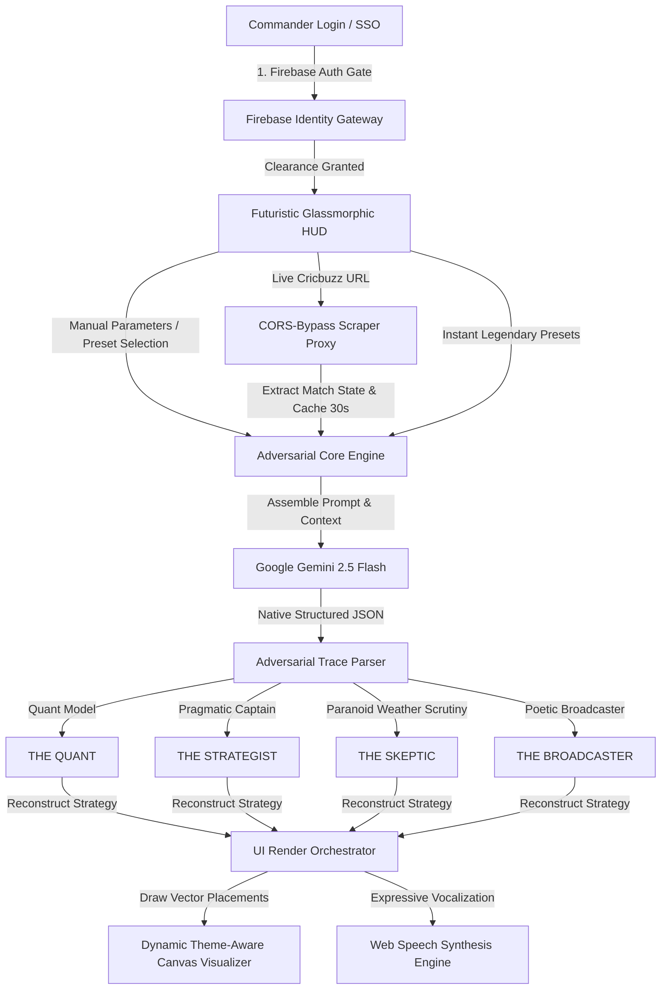

# 🏏 OMEGA — Live IPL Tactical Intelligence OS

### *The Cinematic Multi-Agent IPL Prediction & Strategy Engine — Powered by Google Gemini*

[](https://ai.google.dev/)
[](https://vitejs.dev/)
[](https://firebase.google.com/)
[](#)

> *"OMEGA is not a simple score predictor. It is a live F1-style pit-wall strategy terminal designed for the high-stakes intensity of the IPL dugout, wrapped in an ultra-premium cinematic glassmorphic HUD."*

---

## 🏛️ System Architecture



---

## 🌟 Core System Features

### 1. ⚔️ The Multi-Agent Orchestration Pipeline
OMEGA orchestrates a structured, real-time tactical debate utilizing four independent Gemini agent calls. The system leverages parallel and sequential `Promise.all` orchestration to expose blind spots and identify risks:
*   🧮 **THE QUANT (Phase 1 Parallel):** A clinical probability engine. Computes matchup exploits, boundary pressure indexes, and historical run-rate shifts.
*   😈 **THE SKEPTIC (Phase 1 Parallel):** An adversarial critic. Highlights spinner limitations, boundary-dimension hazards, and micro-climate (dew) failures.
*   👑 **THE STRATEGIST (Phase 2 Sequential):** The practical captaincy brain. Consumes Quant and Skeptic inputs to formulate bowling plans, target coordinates, and pressure-containment goals.
*   🎙️ **THE BROADCASTER (Phase 3 Sequential):** Synthesizes the entire debate trace into poetic, cinematic commentary.

### 2. 🏆 Legendary Scenario Presets (One-Click Testing)
To eliminate manual form filling during analysis, OMEGA includes a high-contrast **Presets** tab loaded with high-tension IPL and World Cup scenarios:
1.  **CSK vs GT (IPL 2023 Final Replica):** Nail-biter chase: 10 runs needed off 2 balls. Jadeja on strike vs Mohit Sharma.
2.  **T20 WC 2024 Final (SA Chase replica):** High pressure: 30 needed off 30 balls. Klaasen set vs Jasprit Bumrah's lethal spell.
3.  **Chepauk Spin Trap:** Classical spin-trap: 85 runs needed off 48 balls. Turning track, spinner Rashid Khan bowling.
*Clicking any card instantly hydrates the form values, maps the physical stadiums, and runs the prediction simulation.*

### 🎙️ 3. Expressive Voice Commentary (Harsha Bhogle Synthesis)
Built-in **Web Speech Synthesis Engine** allows users to listen to the final tactical decision read aloud in professional cricket commentator accentuation:
*   **Expressive Pitch & Rate:** Expressively calibrated with a measured rate (`0.92`) and pitch (`1.05`) to mirror Harsha Bhogle's broadcasting rhythm.
*   **Voice Registry Prioritization:** Dynamically queries system voice libraries to bind English Indian or UK dialects automatically.
*   **Markdown Sanitizer:** Ingests the Gemini output, strips raw technical tags, and reads out a beautiful, expressive commentary.

### 🎨 4. Holographic Iron Man HUD Radar
A highly responsive HTML5 Canvas visualizes exact 2D coordinates for field setups, styled like an F1 pit-wall or Iron Man tactical HUD:
*   **Glassmorphic Aesthetic:** The entire dashboard features a premium deep-space dark mode with backdrop-filters, frosted glass, electric blue neon highlights, and crisp glowing typography.
*   **Dynamic Scanning & Danger Zones:** The canvas radar sweeps dynamically, highlighting critical boundary regions with pulsing red danger rings.
*   **Leak-Free Resize Lifecycle:** Binds bound listeners cleanly and disposes of window resize events in the background to guarantee zero memory overhead.
*   **Energy Saver Loop:** Terminates frame render loops after 8 seconds of active pulsing to preserve system battery and CPU cycles.

### 🛡️ 5. Systems Self-Diagnostic Suite
An integrated diagnostics panel in the configuration hub runs modular health checks:
*   **Scraper Validation:** Pings proxy endpoints to confirm CORS-bypass integrity.
*   **Gemini API Key Validation:** Performs lightweight health-check / ping request to Gemini API.
*   **Firebase SDK Integrity:** Verifies successful initialization of authentication endpoints.

---

## 🛠️ Technical Stack

*   **Core Architecture:** HTML5, Vanilla JavaScript (ESModules)
*   **Design Language:** Grayscale Brutalism, Cormorant Garamond / Inter / JetBrains Mono typography
*   **Build Pipeline & Proxy Routing:** Vite 8
*   **AI Engine:** Google Gemini API (`gemini-2.5-flash`)
*   **Identity Management:** Google Firebase Client SDK
*   **Graphics Engine:** Native 2D Canvas API (Theme-Aware Radar)
*   **Audio Pipeline:** Web Speech API (`window.speechSynthesis`)

---

## 🚀 Installation & Setup

### 1. Prerequisites
*   **Node.js 18+** installed.
*   A [Google Gemini API Key](https://aistudio.google.com/apikey).
*   A Google Firebase Project (for Clearance Gate Authentication).

### 2. Getting Started

1.  **Clone the repository:**
    ```bash
    git clone https://github.com/Hackmaass/CricketAgent-.git
    cd CricketAgent-
    ```

2.  **Install dependencies:**
    ```bash
    npm install
    ```

3.  **Environment Setup:**
    Create a `.env` file in the root folder and configure the following:
    ```env
    # Google Gemini API
    VITE_GEMINI_KEY=your_gemini_api_key

    # Firebase Authentication Configurations
    VITE_FIREBASE_API_KEY=your_firebase_api_key
    VITE_FIREBASE_AUTH_DOMAIN=your_project.firebaseapp.com
    VITE_FIREBASE_PROJECT_ID=your_project_id
    VITE_FIREBASE_STORAGE_BUCKET=your_project.firebasestorage.app
    VITE_FIREBASE_MESSAGING_SENDER_ID=your_sender_id
    VITE_FIREBASE_APP_ID=your_app_id
    ```

4.  **Launch Local Host:**
    ```bash
    npm run dev
    ```
    Open your browser and navigate to `http://localhost:5173`.

---

## 🎮 Command Room Protocol

1.  **Clearance Access:** Click "Clearance Login" or "Launch Command Room" on the minimal home screen. Complete SSO auth using Google.
2.  **Scenario Loading:** Navigate to the **Presets** tab in the sidebar and select any scenario, or paste a live Cricbuzz score URL.
3.  **Execute Prediction:** Review calculated parameters and launch `Run Prediction`.
4.  **Vocalization:** Head to the **Broadcast Feed** tab and click **Listen to Harsha** to synthesize audio review commentary.

---

*Engineered for extreme tactical superiority. Powered by Google Gemini.* 🏏🏆
